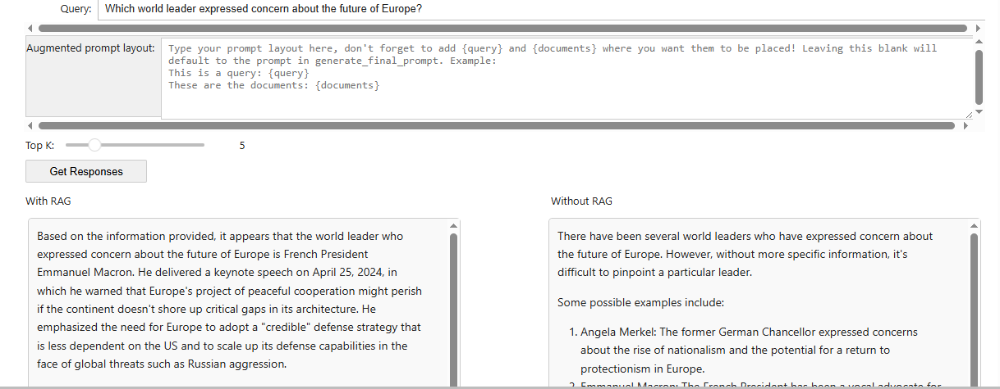

# RAG-Powered News Q&A: Grounding LLMs in Factual, Real-Time Data

This repository contains an end-to-end **Retrieval-Augmented Generation (RAG)** system I architected and built to enhance Large Language Models with factual information from a 2024 news dataset. The core objective is to mitigate LLM hallucinations and provide accurate, verifiable answers grounded in real-world data.

The project features a complete pipeline from raw data processing and semantic retrieval to a final, interactive UI that provides a side-by-side comparison of a standard LLM versus the RAG-enhanced LLM.

---

## 🧠 My Contribution: System Architecture & Implementation

While this project leverages state-of-the-art pre-trained models, my core contribution was **building the complete RAG system from scratch**.

I developed:
* **The End-to-End Pipeline:** The entire workflow, from query ingestion to final answer generation.
* **The Semantic Retrieval Module:** Custom logic to embed a query, compute cosine similarity against a vector database, and retrieve the top-k most relevant documents.
* **The Dynamic Prompt Engineering Engine:** A module to intelligently construct context-aware prompts using the retrieved information.
* **The Interactive Evaluation UI:** A dashboard built with `ipywidgets` for real-time, side-by-side performance analysis.

---

## 📊 Interactive Demo & Key Features

To showcase the system's effectiveness, I developed an interactive widget that provides a clear, immediate comparison between the two approaches.

*A clear, side-by-side comparison of the LLM's performance with and without RAG.*

### Key Features:
* **Semantic Search:** Implemented a retriever using `sentence-transformers` to find documents based on conceptual meaning, not just keywords.
* **Dynamic Context Injection:** The system automatically injects the most relevant news articles into the LLM's prompt.
* **Side-by-Side Performance Comparison:** A user-friendly interface to instantly evaluate the outputs of the RAG-powered LLM vs. the base LLM.
* **Customizable Prompts & Parameters:** The UI allows for adjusting the number of retrieved documents (`Top K`) and modifying the prompt template.

---

## ⚙️ How It Works: The RAG Pipeline

I engineered a multi-stage pipeline to ensure the LLM has the best possible context before generating a response.

> **[User Query]** ➡️ **[1. Text Embedding]** ➡️ **[2. Semantic Retrieval]** ➡️ **[3. Prompt Augmentation]** ➡️ **[4. LLM Generation]** ➡️ **[Context-Aware Answer]**

1.  **Data Loading & Pre-computation:**
    * I loaded a dataset of 870 news articles from 2024.
    * To enable fast semantic search, I pre-computed vector embeddings for all articles. The 768-dimensional vectors capture the semantic essence of each article.

2.  **Semantic Retrieval (The "R" in RAG):**
    * When a user enters a query, I embed it into the same vector space.
    * I then compute the **Cosine Similarity** between the query vector and all 870 article vectors.
    * The system retrieves the `Top K` articles with the highest similarity scores, ensuring the most contextually relevant information is selected.

3.  **Prompt Augmentation:**
    * The retrieved documents are formatted into a clean, readable text block.
    * I constructed a final prompt that combines the original user query with this new, factual context, instructing the LLM to use the provided information to formulate its answer.

4.  **LLM Generation (The "G" in RAG):**
    * This final, augmented prompt is sent to the LLM (`meta-llama/Meta-Llama-3.1-8B-Instruct-Turbo` via the Together AI API).
    * The model then generates a response that is grounded in the factual, up-to-date news articles it was provided.

---

## 🔬 Results & Analysis: RAG in Action

The results clearly demonstrate that the RAG-enhanced LLM consistently outperforms the base model by providing more accurate, detailed, and contextually relevant answers.

### Example 1

---

### Example 2

---

### Example 3

* **Without RAG:** A standard LLM's knowledge depends on its training data's cutoff date and might have no information on recent events.
* **With RAG:** My system instantly retrieves the article from April 25, 2024, and provides the correct answer, showcasing its ability to reason about very recent events.
---
